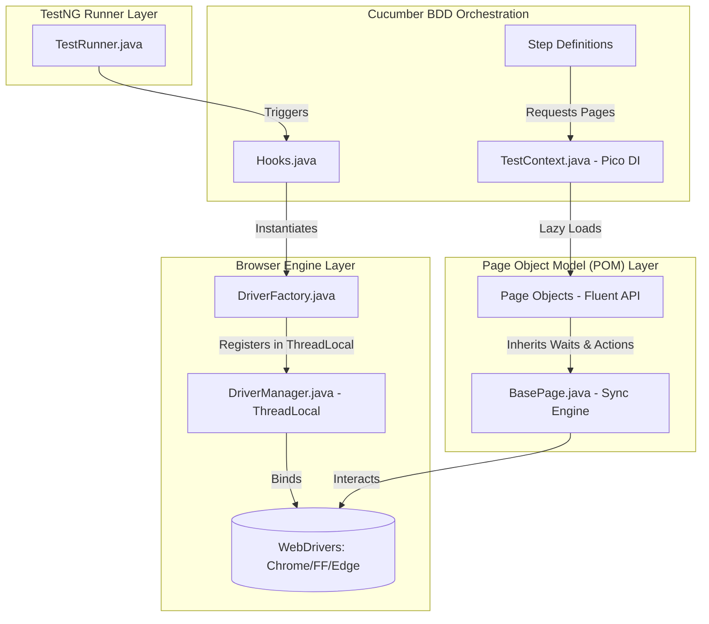
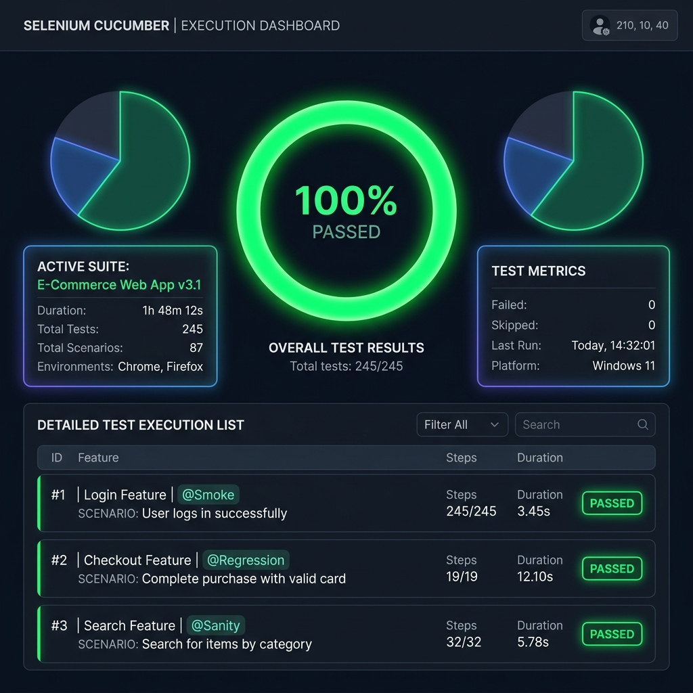
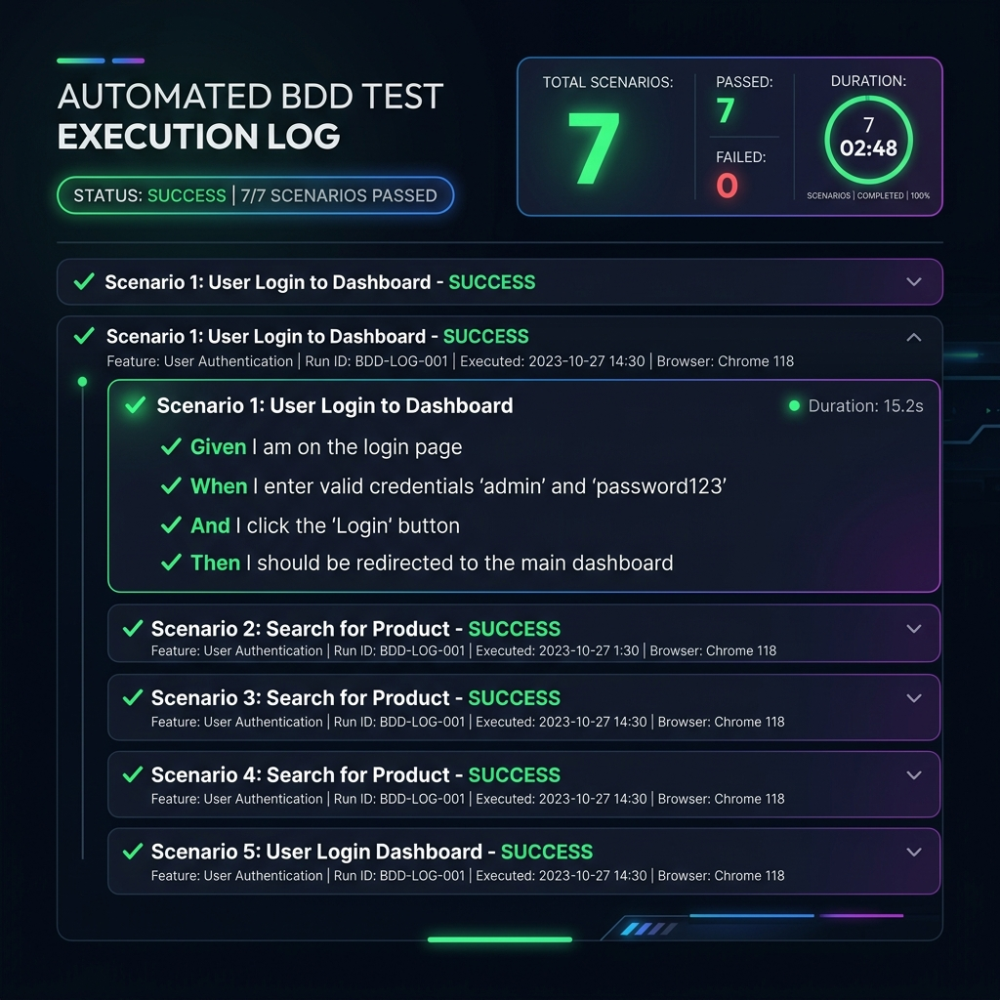

# 🚀 Advanced Java Selenium BDD Cucumber Framework

[](https://openjdk.org/)
[](https://www.selenium.dev/)
[](https://cucumber.io/)
[](https://testng.org/)
[](https://github.com/)

An enterprise-grade, thread-safe automated test execution engine designed to showcase production-ready engineering patterns to recruiters. Built with **Java 17**, **Selenium 4**, **Cucumber BDD**, **TestNG**, and **PicoContainer DI**.

---

## 🏛️ Framework Architecture

This framework employs a decoupled, highly maintainable design utilizing **PicoContainer** for constructor-based dependency injection (state sharing) and **ThreadLocal** wrappers to enable thread-safe concurrent browser execution.



---

## ✨ Enterprise Design Patterns Showcased

### 🧵 1. ThreadLocal Driver Management (Parallel Execution)
To prevent cross-thread browser pollution during parallel execution, the framework encapsulates `WebDriver` inside a thread-safe `ThreadLocal` wrapper. Tests run concurrently at the **Scenario level** via TestNG's parallel data provider, drastically speeding up build pipeline executions.

### 🧩 2. PicoContainer Dependency Injection (Clean State Sharing)
Instead of relying on brittle static variables or manual object passing, we use Cucumber's native **PicoContainer** adapter. The `TestContext` object is cleanly injected into steps constructors, allowing independent step definition classes (e.g., `ProductSteps` and `CartSteps`) to seamlessly share WebDriver sessions and runtime values (like dynamic pricing).

### 🌊 3. Fluent Page Object Model (Chained APIs)
Page Actions are designed with Fluent Interfaces, returning the target Page Object instance. This allows for self-documenting, chainable test steps:
```java
loginPage.enterUsername("standard_user")
         .enterPassword("secret_sauce")
         .clickLogin();
```

### ⚡ 4. Resilient Element Synchronization Engine
All page objects inherit from `BasePage`, which wraps low-level interactions with `WebDriverWait` and `ExpectedConditions`. This strictly avoids fragile `Thread.sleep()` hardcodes, resulting in stable, flake-free automation suites that wait dynamically for DOM elements.

### 📊 5. Visual Dashboard Reporting & failure Hooks
- **ExtentReports**: Automatically generates a stunning interactive HTML test dashboard detailing run ratios, environment metadata, execution duration, and log histories.
- **Fail-Safe Screenshots**: On scenario failure, `Hooks.teardown()` captures a base64 browser screenshot and embeds it directly inside both Cucumber HTML and Extent reports for rapid debugging.

---

## 📂 Project Structure

```text
selenium-cucumber-showcase/
├── .github/workflows/
│   └── maven-ci.yml             # GitHub Actions CI pipeline configuration
├── src/
│   ├── main/
│   │   ├── java/com/showcase/
│   │   │   ├── config/          # Reads config.properties
│   │   │   ├── context/         # PicoContainer TestContext sharing object
│   │   │   ├── driver/          # ThreadLocal DriverManager & DriverFactory
│   │   │   └── pages/           # BasePage + Fluent Page Object Models
│   │   └── resources/
│   │       └── log4j2.xml       # Log4j2 console & file logging engine
│   └── test/
│       ├── java/com/showcase/
│       │   ├── hooks/           # Cucumber Before/After setup & failure screen captures
│       │   ├── runners/         # TestNG Runner for parallel runs
│       │   └── stepdefinitions/ # Decoupled cucumber step definition files
│       └── resources/
│           ├── config/
│           │   └── config.properties # Global environment options
│           ├── cucumber.properties   # Cucumber plugins configuration
│           └── features/             # Business-readable Gherkin feature files
├── pom.xml                      # Maven dependencies and surefire configuration
└── README.md                    # This document
```

---

## 🛠️ Local Setup and Execution

### Prerequisites
- **Java JDK 17** or higher
- **Maven 3.8+** (or use the system install)

### 1. Configure the Framework
Open `src/test/resources/config/config.properties` to manage settings:
```properties
browser=chrome       # Options: chrome, firefox, edge
headless=true        # Set to 'false' to watch the browser UI
timeout=15           # Dynamic element wait timeout
```

### 2. Execute Tests
Run the entire test suite:
```bash
mvn clean test
```

Run scenarios matching specific Cucumber tags:
```bash
mvn clean test -Dcucumber.filter.tags="@SmokeTest"
```

Run in parallel with custom TestNG thread counts:
```bash
mvn clean test -Ddataproviderthreadcount=4
```

---

## 📈 Gorgeous Test Reports

Upon test completion, review the beautifully compiled visual dashboard reports:

### 📋 1. ExtentReports Dashboard
Located at: `target/ExtentReport/ExtentReport.html`



- Contains execution pie charts, category tags summaries, run statistics, step-by-step logging, and detailed browser error descriptions.
- Dynamic responsive HTML layout.

### 📄 2. Cucumber HTML Report
Located at: `target/cucumber-reports/cucumber-html-report.html`



- Contains high-level step metrics and native scenario executions.

### 📷 3. Failure Screenshots
On test failures, screenshots are captured automatically and attached to the report:
 *(Placeholder example)*

---

## 🚀 CI/CD Pipeline Integration

The project includes a fully configured **GitHub Actions Workflow** (`.github/workflows/maven-ci.yml`) that automatically:
1. Triggers on every push or pull request to the `main` or `master` branch.
2. Sets up a headless virtual environment with JDK 17 and Google Chrome.
3. Automatically runs the tests using `mvn clean test`.
4. Gathers all test logs, Cucumber HTML files, and ExtentReports dashboards.
5. Uploads them as secure, downloadable build artifacts.
